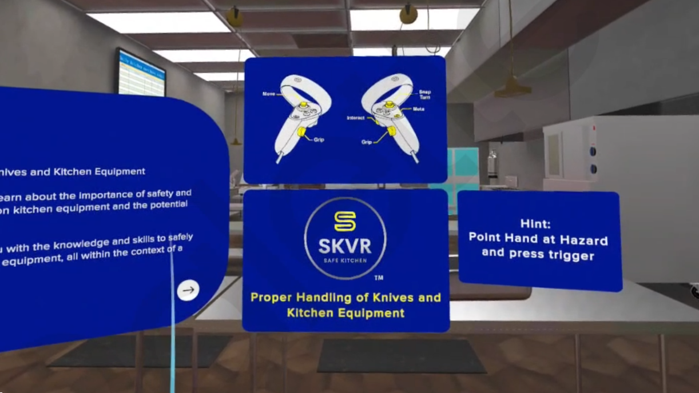

# 🥘 SKVR – Immersive Training Simulator

Transforming workplace safety training with a **real-time interactive VR simulation**, the **Safe Kitchen VR Simulator** places learners inside a **lifelike restaurant-style kitchen** to experience hazards, safe practices, and proper responses **without real-world risks**.  

What if every trainee could **walk through a professional kitchen in VR**, guided by a **ChatGPT-powered safety assistant**, learning to **identify hazards, handle equipment responsibly, and respond to dangerous scenarios** in a safe environment?  
What if training could be **modular, gamified, and measurable**, with **quizzes** reinforcing knowledge and providing **real-time feedback** to learners and administrators?  

This project combines **Unity XR Toolkit**, **Blender 3D modeling**, and **AI-driven assistance** to deliver a **next-generation immersive training platform**.  

---

[▶ Watch Gameplay Demo Video](https://drive.google.com/file/d/10mvSvwlM1RvYSZ8aqwr83UecTXipHM6w/view?usp=drive_link)

---

## 📑 Contents
- [🌍 Overview](#-overview)  
- [🔄 Workflow Summary](#-workflow-summary)  
- [🏗 Virtual Environment](#-virtual-environment)  
- [🤖 AI Assistance](#-ai-assistance)  
- [🎮 User Interaction](#-user-interaction)  
- [📝 Quizzing](#-quizzing)  
- [🧪 Deployment](#-deployment)  
- [🎯 Technology Stack](#-technology-stack)  
- [✅ Outcome](#-outcome)  
- [🔐 Data Privacy & Security](#-data-privacy--security)  

---

## 🌍 Overview
The **Safe Kitchen VR Simulator** delivers **five structured training modules** (5–7 minutes each), balancing **immersion with comfort** for VR newcomers.  

Each module covers a **core area of kitchen safety**:  
1. Identifying Hazards  
2. Proper Handling of Knives & Equipment  
3. Responding to Spills, Burns & Hot Surfaces  
4. Safe Food Handling  
5. Safe Cleaning of Kitchen Equipment  

Learners navigate a **restaurant-style kitchen environment** built in **Blender**, imported into **Unity URP** for VR optimization.  

A **ChatGPT-based assistant bot** provides **real-time guidance**, ensuring learners stay on track.  
➡️ Each module ends with a **5-question quiz** to reinforce learning and measure effectiveness.  

---

## 🔄 Workflow Summary
- **Data Collection** → Compiled safety protocols from chefs, industry guidelines, and verified resources  
- **UX Flow (Figma)** → Designed learner-friendly VR flow; structured sessions under 7 minutes to reduce VR fatigue  
- **3D Environment (Blender)** → Modeled a scaled, realistic kitchen with equipment & hazards  
- **Unity Development (URP + XR Toolkit)** → Implemented VR interactions, lighting, materials, and logic for modules  
- **AI Integration** → Trained a **ChatGPT bot** on kitchen safety knowledge for guidance & feedback  
- **Assessment System** → Built quizzes to validate knowledge retention  

---

## 🏗 Virtual Environment
- Blender-built, restaurant-style kitchen with **accurate scaling**  
- Realistic **textures, lighting, and materials** optimized in **Unity URP**  
- Fully interactive **equipment and hazard simulations**  

---

## 🤖 AI Assistance
- **ChatGPT-based virtual trainer** for step-by-step guidance  
- **Contextual feedback** to keep learners on track  
- Trained specifically on **kitchen safety domain knowledge**  

---

## 🎮 User Interaction
- **Immersive VR-first design** using Unity’s XR Toolkit  
- Hands-on interaction with **knives, stoves, surfaces, and food items**  
- Gamified elements (scoring, feedback, potential leaderboards)  

---

[▶ Watch Gameplay UI_UX Flow](https://www.figma.com/board/cQgocvhTXEDrwipRGhxJeR/Module-5-UX-Flow-and-Storyboard?node-id=0-1&p=f)

---

## 📝 Quizzing
- **5-question quiz** at the end of each module  
- Tracks **progress, comprehension, and retention**  
- Provides **real-time results & reinforcement**  

---

## 🧪 Deployment
- Built in **Unity URP** for optimized VR performance  
- Supports **Android-based VR headsets only**  
- Flexible deployment for **training labs or enterprise rollouts**  

---

## 🎯 Technology Stack

### 🔹 Backend
- Unity scripting logic  
- ChatGPT integration (trained on safety data)  

### 🔹 Frontend
- Unity URP + XR Toolkit (VR interactions)  
- Blender (3D modeling & assets)  
- Figma (UX & UI flow design)  

---

## ✅ Outcome
The **Safe Kitchen VR Simulator** provides a **safe, guided, and gamified training environment** where learners master kitchen safety practices through:  
- **Immersive VR interaction**  
- **AI-powered assistance**  
- **Measurable assessments**  

👉 This solution helps organizations **improve training effectiveness**, **reduce risks**, and **build confidence** in kitchen safety without exposing trainees to real-world hazards.  

---

## 🔐 Data Privacy & Security
Our **data handling approach** prioritizes **client data sovereignty** through:
- **Comprehensive security controls**  
- **Transparent operational practices**  

---
